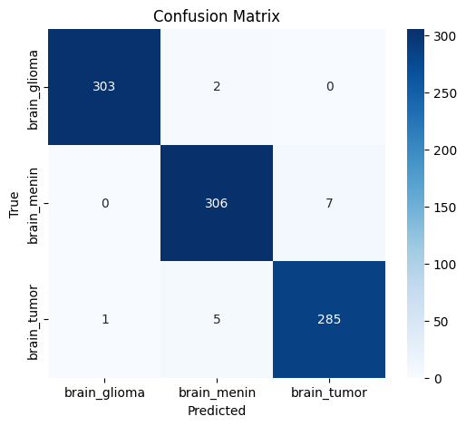
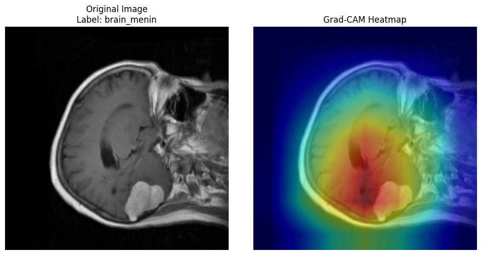

# MRI Brain Tumor Classification Using Deep Learning

This project uses transfer learning with **ResNet18** to classify MRI brain scans into three types of brain cancer: **Glioma**, **Meningioma**, and **General Tumor**. Built with PyTorch and trained on a curated dataset of 6,000+ labeled medical images, the model achieves strong performance and interpretability using **Grad-CAM**.

## Highlights

* **Real-world medical dataset** from hospitals (6,056 MRI scans)
* **Transfer learning** with ResNet18 pretrained on ImageNet
* **Achieved \~98% accuracy** on unseen test MRI images
* **Grad-CAM visualizations** to highlight what the model focuses on
* Built and trained entirely in Google Colab with GPU acceleration
* Clean training pipeline with train/val/test splits and augmentation

## Dataset

* Source: [Mendeley Data - Md Mizanur Rahman](https://doi.org/10.17632/mk56jw9rns.1)
* Classes:

  * `brain_glioma/`
  * `brain_menin/`
  * `brain_tumor/`
* All images resized to **224x224**, normalized using ImageNet statistics

## Technologies Used

* Python, PyTorch, torchvision
* Scikit-learn, Seaborn, Matplotlib
* Google Colab (GPU)

## Results

| Metric        | Score |
| ------------- | ----- |
| Test Accuracy | \~98% |
| Precision     | \~98% |
| Recall        | \~98% |
| F1-Score      | \~98% |

## Grad-CAM Example

Model focuses attention on tumor regions, validating spatial learning.

## Future Improvements

* Try ResNet50 or EfficientNet for higher accuracy
* Try applying Learning Rate Scheduling

## Citation

Rahman, Md Mizanur (2024), "Brain Cancer - MRI dataset", Mendeley Data, V1, doi: 10.17632/mk56jw9rns.1

https://medium.com/@stepanulyanin/implementing-grad-cam-in-pytorch-ea0937c31e82
